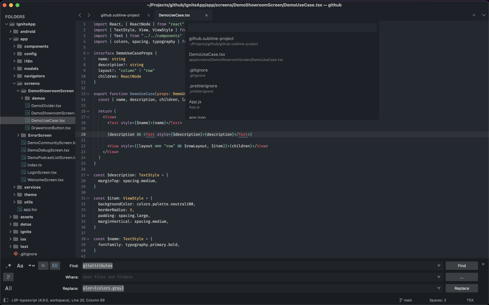

# Adaptify Theme
A customized version of the default _*Adaptive Theme*_ for [Sublime Text](https://www.sublimetext.com). Simple, modern and flat.

## Preview
### Adaptify Dark
A Color scheme that I personally use that comes with this theme. See [below](#Adaptify-dark-color-scheme) for usage.
`UI: Select Color Scheme -> Adaptify Dark`


### Adaptify Mariana
`UI: Select Color Scheme -> Marian`



### Default Sixteen
`UI: Select Color Scheme -> Sixteen`


_You can use any other Color Scheme you want, FYI_

## Installation

### Package Control
The easiest way to install is using [Sublime Package Control](https://sublime.wbond.net), where Adaptify is listed as `Theme - Adaptify`.

1. Open Command Palette using menu item `Tools -> Command Palette...` (<kbd>⇧</kbd><kbd>⌘</kbd><kbd>P</kbd> on Mac)
2. Choose `Package Control: Install Package`
3. Find `Theme - Adaptify` and hit <kbd>Enter</kbd>

### Manual
You can also install the theme manually:

1. [Download the .zip](https://github.com/lodev09/Adaptify/archive/refs/heads/master.zip)
2. Unzip and rename the folder to `Theme - Adaptify`
3. Copy the folder into `Packages` directory, which you can find using the menu item `Sublime Text -> Preferences -> Browse Packages...`

## Activation
1. Open Command Palette using menu item `Tools -> Command Palette...` (<kbd>⇧</kbd><kbd>⌘</kbd><kbd>P</kbd> on Mac)
2. Choose `UI: Select Theme`
3. Choose `Adaptive` and hit <kbd>Enter</kbd>

## Bonus

### FileIcons
The package [FileIcons](https://packagecontrol.io/packages/FileIcons) works with the Adaptive theme by default. Just follow their installation and you're good to go.

### Adaptify Dark Color Scheme
This theme ships with my favorite Color Scheme. It was a modified version of the old Boxy theme. To activiate:

1. Open Command Palette using menu item `Tools -> Command Palette...` (<kbd>⇧</kbd><kbd>⌘</kbd><kbd>P</kbd> on Mac)
2. Choose `UI: Select Color Scheme`
3. Choose `Adaptive Dark` and hit <kbd>Enter</kbd>

### Settings I use
The following is the settings I use for this theme. Feel free to copy :)

```json
{
	"bold_folder_labels": true,
	"fade_fold_buttons": false,
	"font_face": "Fira Code Retina",
	"font_options":
	[
		"subpixel_antialias"
	],
	"font_size": 12,
	"highlight_line": true,
	"highlight_modified_tabs": true,
	"ignored_packages":
	[
		"Vintage",
	],
	"line_padding_bottom": 1,
	"line_padding_top": 1,
	"scroll_past_end": true,
	"show_full_path": true,
	"word_wrap": true,
	"preview_on_click": false,
	"tab_completion": false,
	"file_tab_style": "square",
	"theme": "Adaptive.sublime-theme",
	"color_scheme": "Adaptify Dark.sublime-color-scheme",
}

```